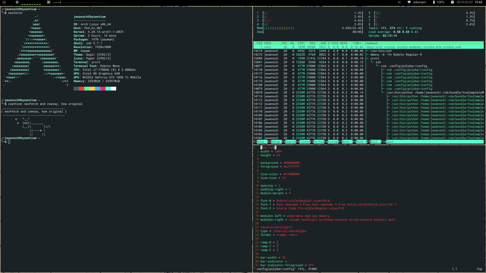

# Dotfiles

This repository contains my dotfiles for [sway](https://swaywm.org/), [waybar](https://github.com/Alexays/Waybar),
[wofi](https://hg.sr.ht/~scoopta/wofi), [mako](https://github.com/emersion/mako), and
[gammastep](https://gitlab.com/chinstrap/gammastep).

# Daemons

Most sway specific services are started via systemd.
```
sway-session.target
● ├─enkei.service
● ├─kanshi.service
● ├─lxpolkit.service
● ├─mako.service
● ├─swayidle.service
● ├─waybar.service
● ├─xdg-desktop-portal-wlr.service
```

# Look

