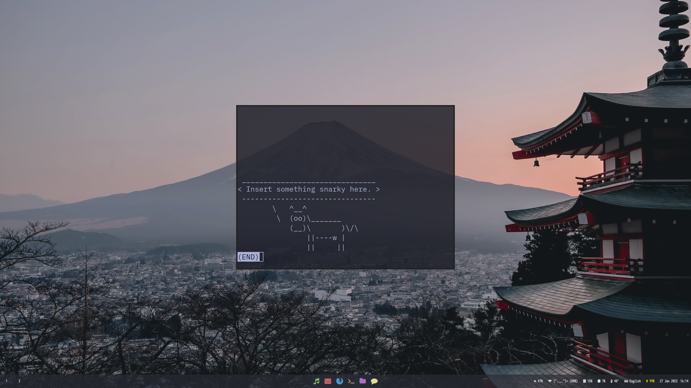

# Dotfiles

This repository contains my used dotfiles for bspwm, polybar & sxhkd

## bspwm
Largely standard with a few adjustments for my own used applications

`bspwm requires this to be in executable`

## polybar
Modified version of space theme by jaagr. This version is compressed to only one bar in the top, thinner and uses less animations as well as a wider
spaced menu and Twitter Emojis.

This bar requires a few fonts to be displayed correctly namely:  
- `Fira Code`
- `Twemoji Color Emoji`

## sxhkd
Again quite a few standard bindings, but adjusted to fit with the style of the rest and bind media keys

# Look

